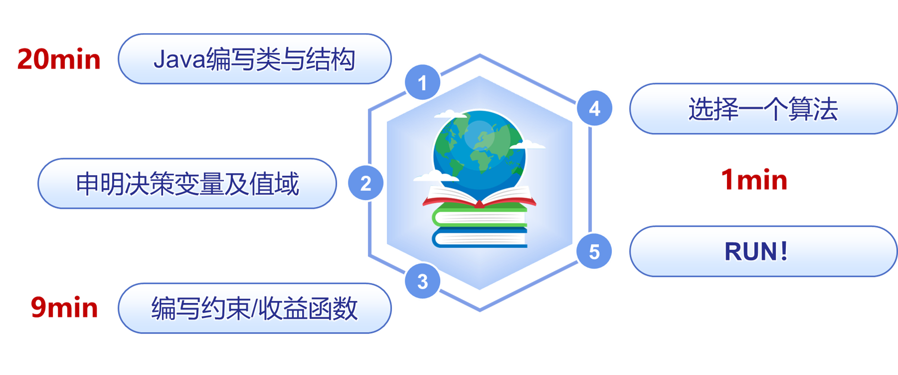

# 工程级组合优化求解器NOPT(beta)

### 🚀 项目亮点 (Key Features)
- 📦10大工程问题+10大经典优化问题
- 🤝易上手，好拓展，30分钟组合优化建模求解
- ⏩100%Java原生，源码开源，0调用其他函数包
- 📊通用启发式/元启发式算法库 + 内置可视化工具

> - 📦 10+ engineering problems + 10 classic optimization problems
> - 🤝 Easy to start with, easy to extend; model and solve combinatorial optimization problems in 30 minutes
> - ⏩ 100% native Java, open-source, with zero dependencies on external function libraries
>- 📊 General heuristic/metaheuristic algorithm library + built-in visualization tools

### 💡 什么是NOPT？(What is NOPT?)
NOPT是一款可求解多类型优化问题的工程级组合优化求解器，集成了10大经典优化问题与超10种工程问题。NOPT用户定位广泛，包括高校学生、管理运筹业务部门，研发部门等。

>NOPT is an engineering-grade combinatorial optimization solver capable of solving multiple types of optimization problems. It integrates 10 classic optimization problems and over 10 engineering problems. NOPT targets a wide range of users, including university students, operations research departments in management, and R&D departments.

### ⚡ 30分钟快速上手 (Get Started in 30 Minutes)
##### a. 总体流程 (Overall Process)
- 20分钟设计类与结构，申明决策变量与值域
- 9分钟编写约束和收益函数
- 1分钟选择算法开始运行
>- 20 minutes: Design classes and structures, declare decision variables and their domains
>- 9 minutes: Write constraints and the objective function
>- 1 minute: Select an algorithm and start running

##### b. 准备工作 (Preparation)
- 编程语言：JDK 8 (https://www.oracle.com/java/technologies/downloads/#java8-windows)
- 环境：IntelliJ IDEA Community（推荐）https://www.jetbrains.com.cn/idea/download/?section=windows
- 依赖：1. 基础的编程依赖（NOPT dependencies文件下）2. 无其他任何模型包、算法包依赖

>- Programming Language: JDK 8 (https://www.oracle.com/java/technologies/downloads/#java8-windows)
>- Environment: IntelliJ IDEA Community (Recommended) https://www.jetbrains.com.cn/idea/download/?section=windows
>- Dependencies: 1. Basic programming dependencies (located in the NOPT dependencies folder) 2. No other model or algorithm library dependencies
##### c. 决策变量建模与申明 (Decision Variable Modeling and Declaration)
- 申明组合优化问题中存在的组合关系，即决策本体（DecisionEntity）与决策变量（DecisionVariable）之间的组合配对关系
- 决策变量可以是null值，布尔变量，数字变量
>- Declare the combinatorial relationships in the optimization problem, i.e., the pairing relationship between decision entities (DecisionEntity) and decision variables (DecisionVariable)
>- Decision variables can be null, Boolean, or numeric values.

    // 1. Example: NQueens problem
    public class Queen extends DecisionEntity {
    @DecisionVariable                            // Declaration
    private Square square;                       // Decision variable: which square to place the queen
    private List<Square> optionalSquareList;
    // getter & setter
    ... ...
    }

    // 2. Example: Knapsack problem (Object-oriented modeling)
    public class Object extends DecisionEntity {
    @DecisionVariable                             // Declaration
    private Boolean carry;                        // Decision variable: whether to pack the item
    private List<Boolean> optionalCarryList
            = Arrays.asList(true, false);
    // getter & setter
    ... ...
    }
    // Alternatively (Knapsack-oriented modeling)
    public class Object extends DecisionEntity {
    @DecisionVariable(nullable = true)            // Declaration
    private Knapsack knapsack;	                  // Decision variable
    private List<Knapsack> optionalKnapsackList;
    // getter & setter
    ... ...
    }
    
    // 3. Example: Binpacking problem
    public class Item extends DecisionEntity {
        @DecisionVariable                         // Declaration
        private Integer priority;                 // Decision variable: priority order
        private List<Integer> optionalPriorityList
            = Arrays.asList(0, 100);
        // getter & setter
    ... ...
    }
##### d. 评分（约束/收益）模型构建与申明 (Scoring (Constraint/Objective) Model Construction and Declaration)
- 约束继承Constraint类
- 修改评分函数
- 按需计算约束/收益
- 可增量式计算
>- Constraints inherit the `Constraint` class
>- Modify the scoring function
>- Compute constraints/objective on demand
>- Supports incremental calculation

    public class CalScore extends Constraint {           // Inherit Constraint class
        @Override
        public Score calScore() {
            Graph graph = (Graph) solution;		         // Get the graph object
            List<Node> nodeList = graph.getNodeList();   // Get node objects
            int conflicts = 0;
            for(Node node : nodeList) {		             // Iterate through nodes
                conflicts += node.getConflict();	     // Accumulate conflict count
            }
            Score score = new Score();		             // Create a new Score object
            score.setHardScore(- conflicts);	         // Set the constraint value (penalty)
            return score;				                 // Return the score
        }
    }

##### e. 算法选用与拓展 (Algorithm Selection and Extension)
- 从算法库选择算法
- 创建算法实例并设置参数
- algorithm.run运行！
>- Select an algorithm from the algorithm library
>- Create an algorithm instance and set parameters
>- Run with `algorithm.run`!

    // Create algorithm instance
    LateAcceptance algorithm = new LateAcceptance();

    // Set parameters
    algorithm.setLateSize(100);
    algorithm.setTabuSize(5);
    algorithm.setIteration(5000000);
    algorithm.setOperatorList(
              Arrays.asList(new RandomMove());
    algorithm.setSolution(bin);
    
    // Run the algorithm
    algorithm.run
    ... ...
##### f. 内置GUI用法 (Built-in GUI Usage)
- 继承SolutionGUI类，改写JPanel类
- 可绘制算法迭代过程，可视化决策变量状态，对比不同算法质量，输出算法日志等
>- Inherit the `SolutionGUI` class and override the `JPanel` class
>- Enables drawing the algorithm iteration process, visualizing decision variable states, comparing algorithm quality, outputting algorithm logs, etc.
### 🧭 下一步 (Next Steps)
- 丰富算法库，正视算法性能差距，提升经典OR问题求解质量
- 形成品牌，提炼核心竞争力
- 丰富案例库，编写《User's Guide》，发布1.0版
- LLM自动建模+求解
>- Enrich the algorithm library, address performance gaps, and improve solution quality for classic OR problems
>- Build the brand and refine core competitiveness
>- Expand the case library, compile the *User's Guide*, and release version 1.0
>- LLM-powered automatic modeling + solving

### 📄 许可证 (License)
NOPT选择Apache 2.0 协议，所有用户应在该许可证的规范下使用NOPT求解器。
>NOPT adopts the Apache 2.0 License, and all users shall use the NOPT solver in compliance with the specifications of this license.
### ✨ 联系我们 (Contact us)
国防科技大学 ╳ 清华大学 ╳  北京理工大学 ╳ 中南大学 ╳ 西安电子科技大学 ╳ 树优信息技术有限公司\
姓&emsp;&emsp;名： 杜永浩 副教授 \
联系方式：13272400834  / duyonghao15@163.com \
通讯地址：湖南省长沙市开福区国防科技大学系统工程学院，410072

### 🎓 参考文献 (References)
- [1] Du Y, Wang T, Xin B, et al. A data-driven parallel scheduling approach for multiple agile earth observation satellites [J]. IEEE Transactions on Evolutionary Computation, 2020, 24(4): 679–693.
- [2] Du Y, Xing L, Chen Y, et al. Satellite scheduling engine: The intelligent solver for future multi-satellite management [J]. Frontiers of Engineering Management, 2022, 9(4): 683-688.
- [3] Yao F, Du Y, Li L, et al. General modeling and optimization technique for real-world earth observation satellite scheduling [J]. Frontiers of Engineering Management, 2023, 10(4): 695-709.
- [4] Chen M, Du Y, Tang K, et al. Learning to construct a solution for the agile satellite scheduling problem with time-dependent transition times [J]. IEEE Transactions on Systems, Man, and Cybernetics: Systems, 2024, 54(10): 5949-5963.
- [5] Du Y H, Wang L, Xing L N, Yan J G, Cai M S. Data-driven heuristic assisted memetic algorithm for efficient inter-satellite link scheduling in the BeiDou Navigation Satellite System [J]. IEEE/CAA Journal of Automatica Sinica, 2021, 8(11): 1800-1816.
- [6] 杜永浩, 黎磊, 徐世龙, 等. 基于智能优化算法引擎的可演进星群智能任务规划[J]. 电子与信息学报, 2025, 47(6): 1645-1657.
